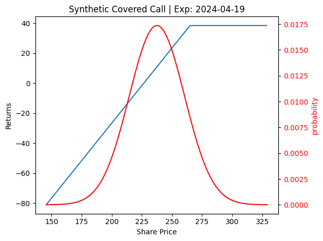
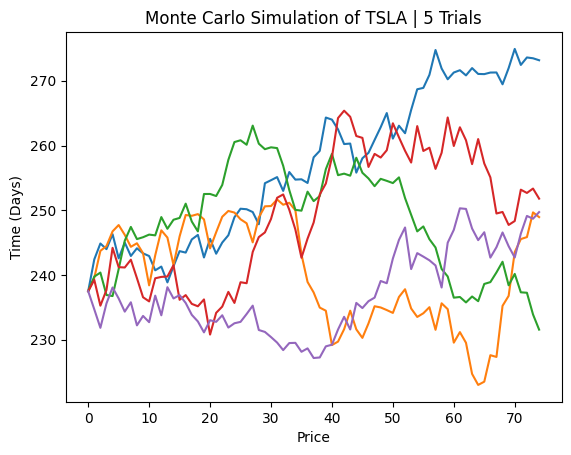
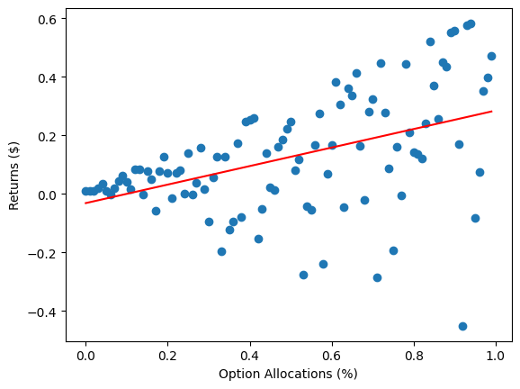
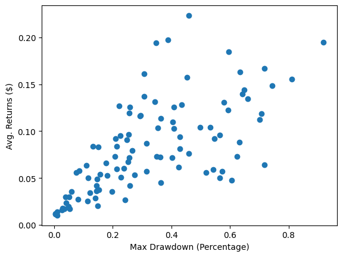

# Background

[Yieldmax](https://www.yieldmaxetfs.com/our-etfs/) is a company that hosts a collection of ETF's that trade Synthetic Covered Calls on popular stocks in attempts to capture monthly income through these option premiums.

# Data

All Stock and Options data derived from [Tradier](https://www.tradier.com).

# Strategy



Market Data from 1/6/2024 at around 1pm.

Strikes were as follows:
- Long Call ATM:  240.0
- Short Put ATM:  240.0
- Short Call OTM:  265.0

Current price of TSLA - $237.49

Where the green verticle line is the current price of TSLA, and the red verticle line is the break even price of TSLA.

# Simulation



Shows what a Monte Carlo Simulation of TSLA stock over time period of option contract with 5 different simulations.

# Results

I set up different allocations of a cash balance ($1,000,000) where the option allocation is between (0, 100)% and the rest of the balance is allocated towards short term treasuries, returning an interest at the current rate of ~5.25%.

<!-- 


The strategy appears to have a weak positive relationship between option allocation and returns, showing that the strategy is outpreforming short-term treasury bills.

Best Fit Line data:
```
Slope: 0.31616203507715607
Intercept: -0.03168971855652475
R-value: 0.458842637103749
P-value: 1.5769465133709017e-06
Standard error: 0.06184419248624469
```



Since the strategy is a synthetic covered call, there is exposed downside risk, the larger the balance that is put into the strategy, the higher the liklihood of a catastrophic drawdown.

Though the strategy can work in the short term, due to the exposed downside risk, it is important to keep in mind the risk of losing a sizable portion of the portfolio.

Therefore, similar to yieldmaxes trading strategy, it makes sense to only allocation a small portion of a trading balance to minimize the possibility liquidation. -->
