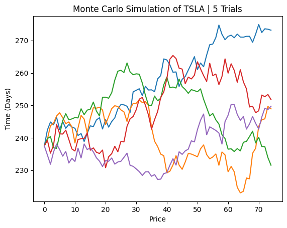

# Background

[Yieldmax](https://www.yieldmaxetfs.com/our-etfs/) is a company that hosts a collection of ETF's that trade Synthetic Covered Calls on popular stocks in attempts to capture monthly income through these option premiums.

# Data

All Stock and Options data derived from [Tradier](https://www.tradier.com).

# Strategy

Market Data from 1/6/2024 at around 1pm.

Strikes were as follows:
- Long Call ATM:  240.0
- Short Put ATM:  240.0
- Short Call OTM:  265.0

Current price of TSLA - $237.49

Where the green verticle line is the current price of TSLA, and the red verticle line is the break even price of TSLA.

# Simulation

Shows what a Monte Carlo Simulation of TSLA stock over time period of option contract with 5 different simulations.

# Results

I set up different allocations of a cash balance ($1,000,000) where the option allocation is between (0, 100)% and the rest of the balance is allocated towards short term treasuries, returning an interest at the current rate of ~5.25%.

